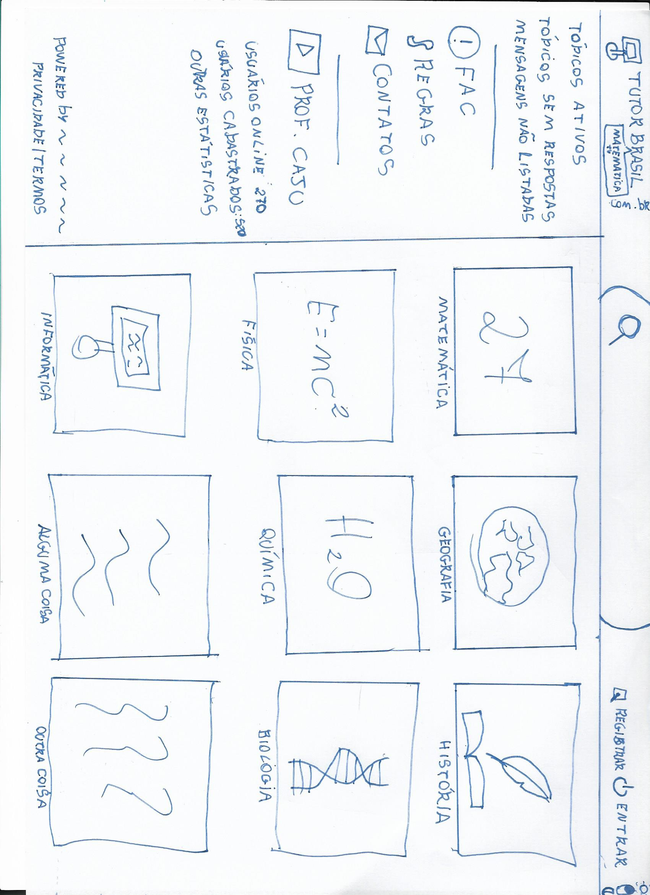
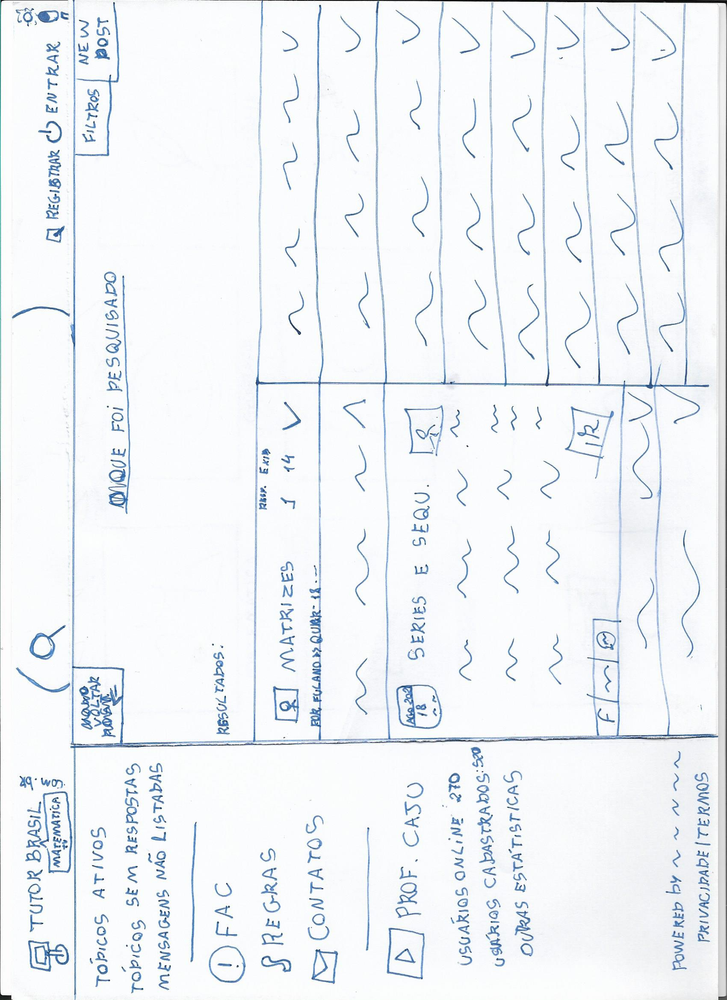
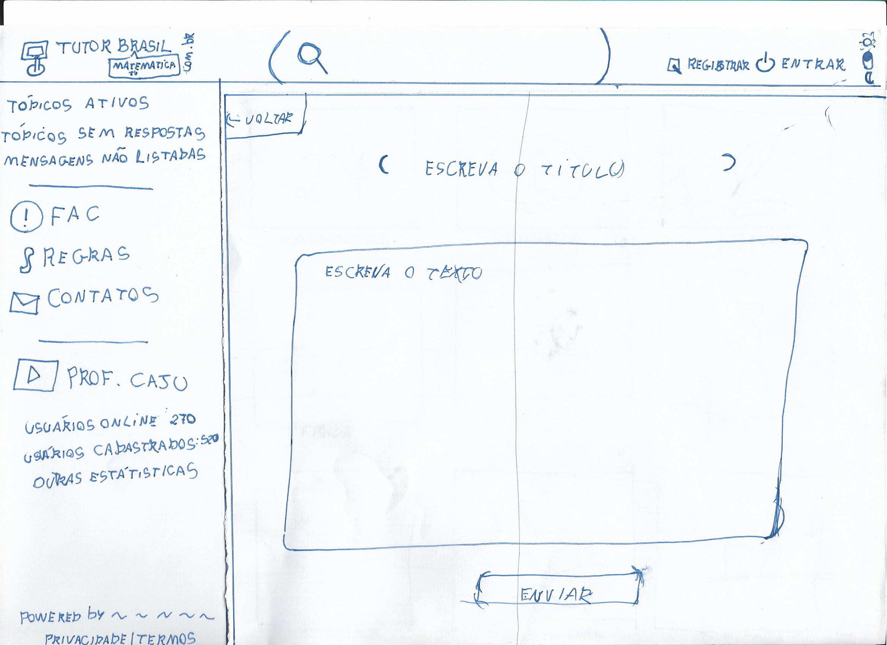
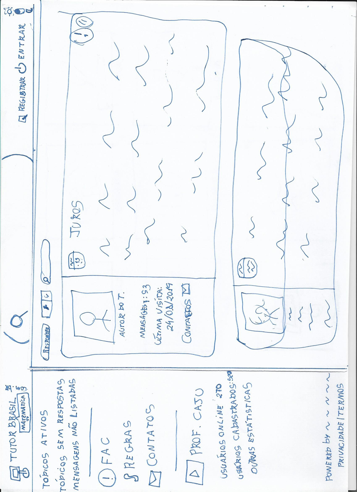

# Protótipo de Baixa Fidelidade

## Introdução

Um Protótipo de Baixa Fidelidade visa definir de modo simples como seria a interação do usuário com o projeto, tendo pouca preocupação com elementos ligados ao design, em especial, paleta de cores e detalhes. Muitas vezes é utilizado para auxiliar na definição do projeto e levantamento dos requisitos necessários. 

## TutorBrasil

O TutorBrasil é um fórum de estudos para estudantes do nível fundamental, médio e superior. O objetivo principal do fórum é ser um ambiente de troca de conhecimento através da resolução e elaboração de exercícios, de diversas disciplinas. Além disso, serve como canal de divulgação para as aulas gravadas do canal do YouTube [Prof. Caju - Matemática TutorBrasil](https://www.youtube.com/channel/UCDX7vKxwHLVaVVd7awR6z1g).

## Protótipo

### Página inicial

### Página de resultados de pesquisa de tópico

### Página de elaboração de exercícios

### Página de resolução de exercícios

## Histórico de revisão

| Data | Autor | Modificações | Versão |
| ---- | ----- | ------------ | ------ |
| 19/08/2021 | [Luís Lins](https://github.com/luisgaboardi) | Criação do documento | 1.0 |
| 29/08/2021 | [Lucas Rodrigues](https://github.com/nickby2) | Adicionando introdução, apresentação e imagens | 2.0 |
| 30/08/2021 | [Luís Lins](https://github.com/luisgaboardi) | Melhorias no texto | 3.0 |