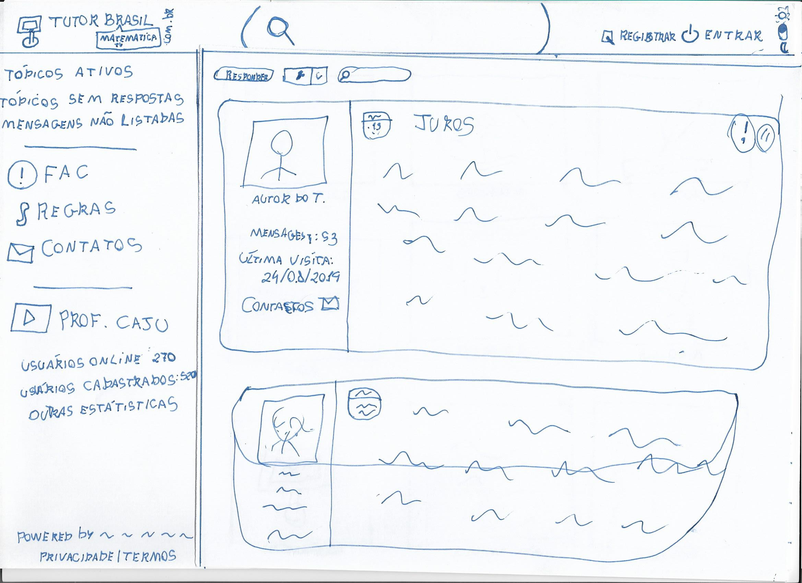

# Protótipo de Baixa Fidelidade

## Histórico de revisão

| Data | Autor | Modificações | Versão |
| ---- | ----- | ------------ | ------ |
| 19/08/2021 | [Luís Lins](https://github.com/luisgaboardi) | Criação do documento | 1.0 |

## Introdução

* O prototipo de baixa fidelidade simula características do projeto, sendo que a ênfase e na funcionalidade e não na éstetica. Nesse tipo de modelo, obtendo um feedback de usuários que farão o teste preliminar. 

## Tutor Brasil

* O Tutor Brasil, é um fórum de estudos para estudantes do nível fundamental, médio e superior. O objetivo principal do fórum é reunir grupos de alunos para elaborar e resolver diversos tipos de exercícios de diferentes diciplinas. 

