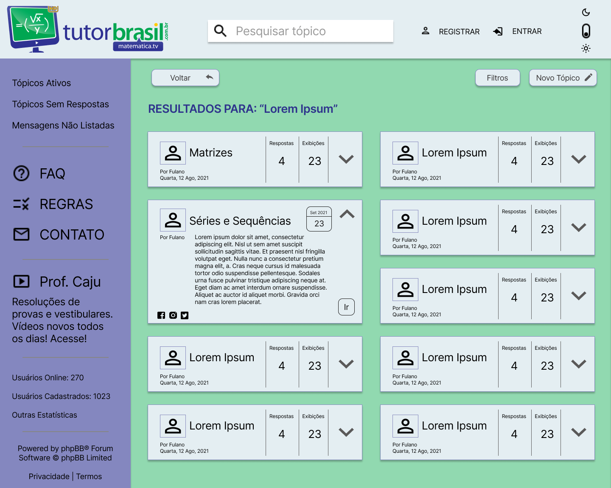
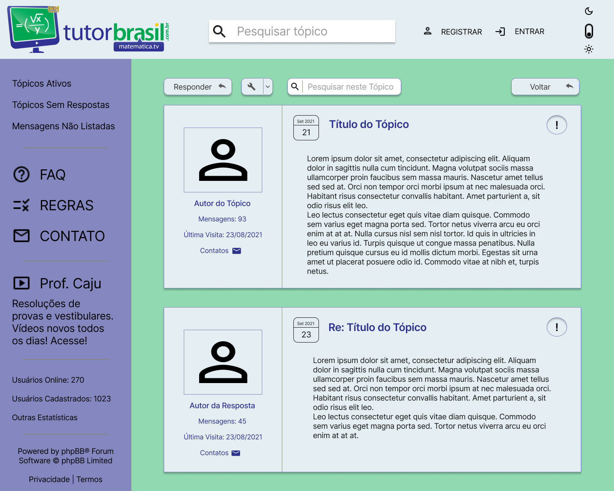
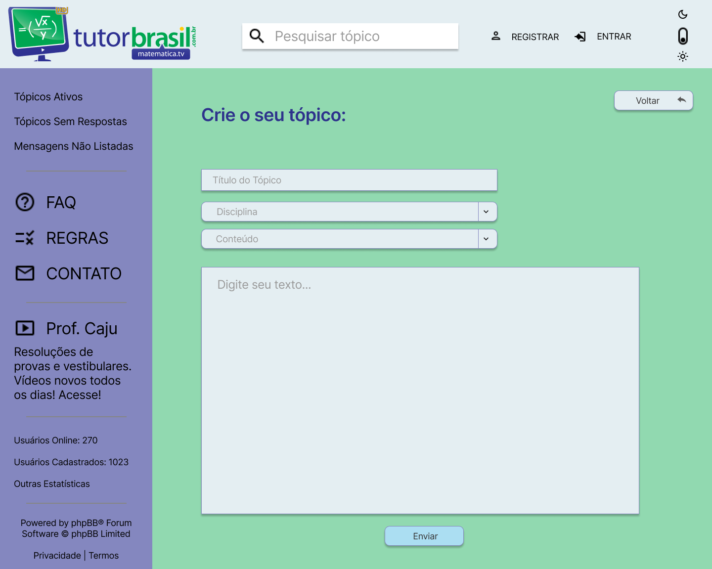

# Protótipo de Média Fidelidade

## Introdução

Um Protótipo de Média Fidelidade é um protótipo de funcionalidade limitada e visual básico, mas com um nível considerável de navegação, apresentando as possibilidades da interação com a aplicação. São usados para definir o fluxo de uso das atividades a serem realizadas no site, muitas vezes referido como História de Usuário. Através disso, podemos perceber quais são as melhorias que podem ser feitas para que o produto esteja de acordo com os requisitos funcionais e não funcionais.

## Análise
A proposta de melhoria de interface consistiu em deixá-la menos poluída visualmente, com as cores da logo TutorBrasil de forma a se tornar mais intuitiva e menos cansativa de se usar. Cada página proposta foi feita por um integrante do grupo e revisada por todos no final do processo.

## Metodologia
De acordo com o conteúdo de Interação Humano Computador o grupo foi reunindo as seguintes metodologias para desenvolver o protótipo:
 * Cuidado com falsas affordances as quais poderiam gerar ao usuário ideias de usabilidade diferentes em determinados campos como: inserir texto

 * Estilo interface Manipulação de Navegação: com ações reversíveis e com feedback imediato e com estilo de fácil aprendizado para usuários iniciantes.
 
 * Foco em Usabilidade, Experiência de usuário e comunicabilidade
 
 * Usando abordagens como Lei de Fitts e Princípios de Gestalt para posicionamento de itens 
 
 * Avaliando tanto a perspectiva de quem usa quanto de quem está fazendo as modificações por meio de questionários e entrevistas.

## Protótipo

### Página inicial

### Escolha de Tema e Resultado de Pesquisa

### Respostas e Resoluções de Exercícios

### Elaboração de Exercícios

## Histórico de revisão

| Data | Autor | Modificações | Versão |
| ---- | ----- | ------------ | ------ |
| 19/08/2021 | [Luís Lins](https://github.com/luisgaboardi) | Criação do documento | 1.0 |
| 10/09/2021 | [Luís Lins](https://github.com/luisgaboardi) | Adiciona introdução e organização do conteúdo do documento | 2.0 |
| 16/09/2021 | Ugor Costa | Adiciona conteúdo e imagens da página  | 3.0 |
| 17/09/2021 | [Luís Lins](https://github.com/luisgaboardi) | Arruma espaçamento dos tópicos e reorganiza imagens | 4.0 |
