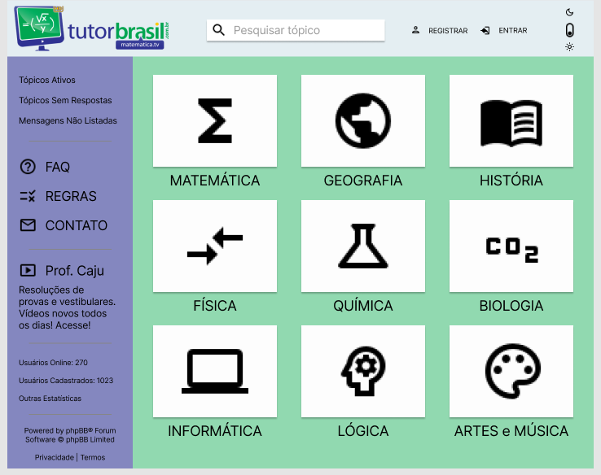
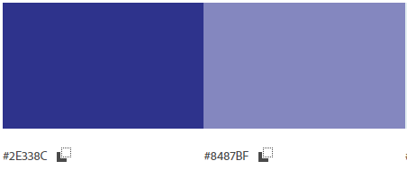
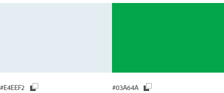
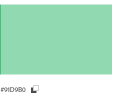

# Identidade Visual

## Introdução

Identidade visual é o conjunto de elementos gráficos que objetivam comunicar ao público a ideia, os valores, o propósito e a missão do produto. Os elementos da identidade visual que serão abordados são:

- Paleta de cores: cores utilizadas na aplicação. Caracteriza o site;
- Logomarca: Logo do site;
- Tipografia: fonte utilizada.

## Paleta de cores

Para realizar a definição das cores, escolhemos manter a paleta de cores atual do site, entretanto, modernizar a sua utilização e disposição no site, de acordo com as definições do protótipo de baixa e média fidelidade. Com as cores escolhidas podemos ver um exemplo do protótipo de média fidelidade para observarmos como ficaria a interface:

## Paleta

## Histórico de revisão

| Data | Autor | Modificações | Versão |
| ---- | ----- | ------------ | ------ |
| 19/08/2021 | [Luís Lins](https://github.com/luisgaboardi) | Criação do documento, introdução e paleta de cores | 1.0 |