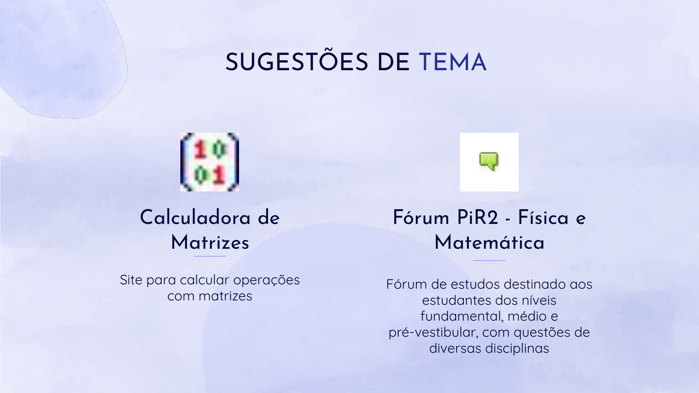

# 1º Ponto de Controle

## Descrição
O primeiro ponto de controle da disciplina serviu para a discussão do tema da equipe junto com o professor, seguida da elaboração de um backlog e de um cronograma provisório de desenvolvimento para a equipe.

## Apresentação

## Histórico de revisão

| Data | Autor | Modificações | Versão |
| ---- | ----- | ------------ | ------ |
| 19/08/2021 | [Luís Lins](https://github.com/luisgaboardi) | Adiciona descrição e apresentação do ponto de controle | 1.0 |