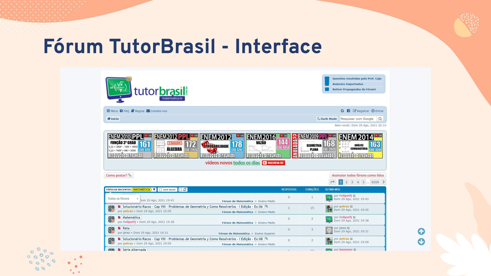
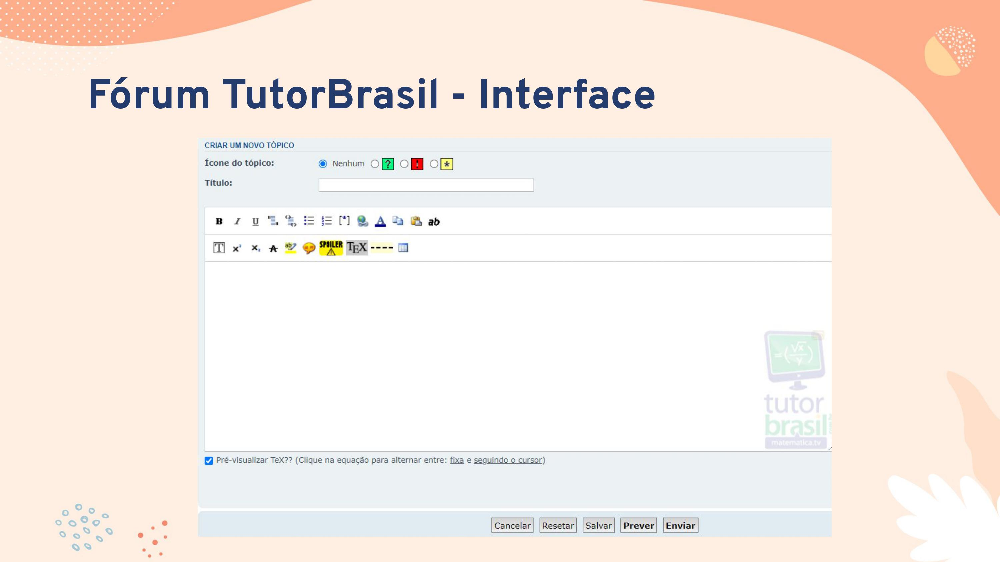
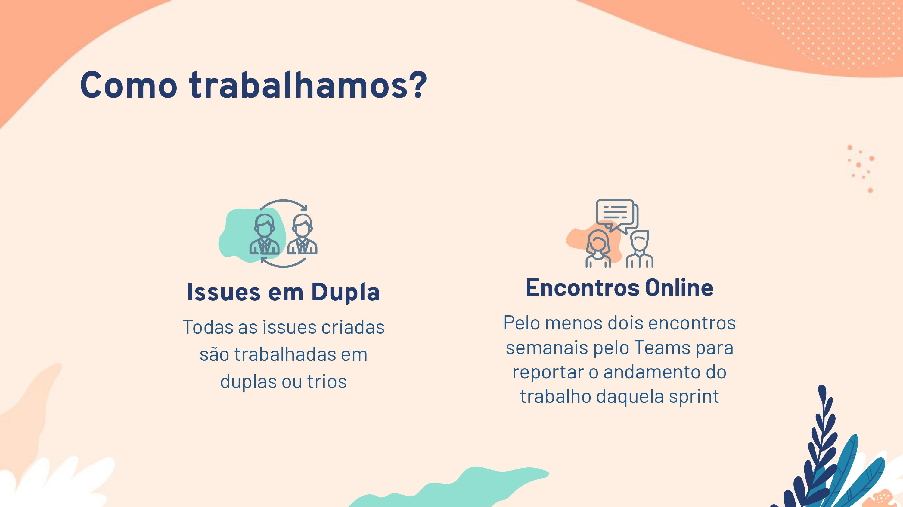
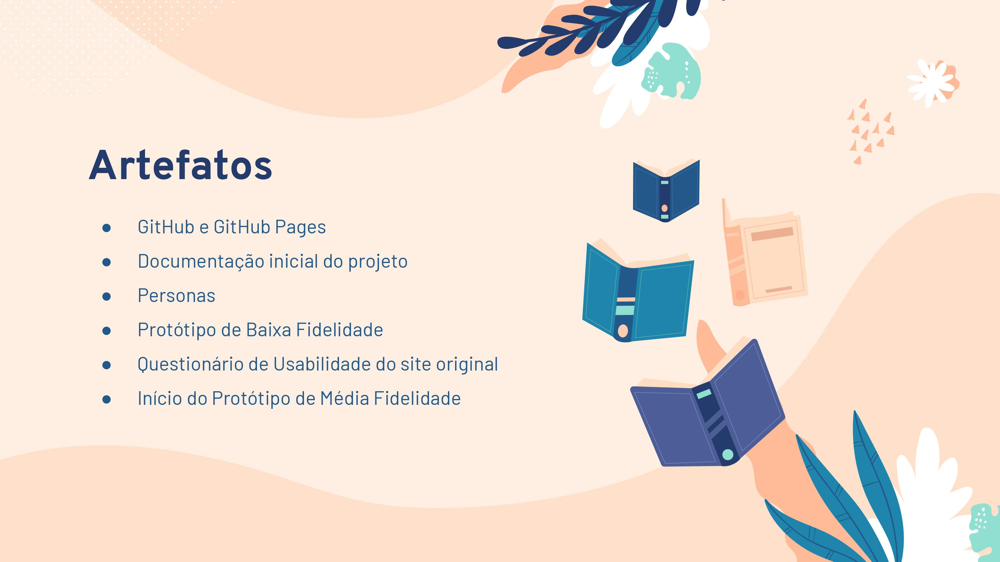

# 2º Ponto de Controle

## Descrição
O segundo ponto de controle da disciplina serviu como espaço para atualizar o andamento do projeto para o professor e para turma. Nele, discutimos sobre o [protótipo de baixa fidelidade](../project/prototypes/low-prototype.md), o [questionário de usabilidade](../project/surveys/survey-01.md) do site e também sobre toda a questão e documentação da gerência do projeto, tal como as [personas](../project/personas.md).

## Apresentação

## Histórico de revisão

| Data | Autor | Modificações | Versão |
| ---- | ----- | ------------ | ------ |
| 01/09/2021 | [Luís Lins](https://github.com/luisgaboardi) | Criação do arquivo e adiciona descrição | 1.0 |
| 01/09/2021 | [Luís Lins](https://github.com/luisgaboardi) | Adiciona apresentação | 2.0 |