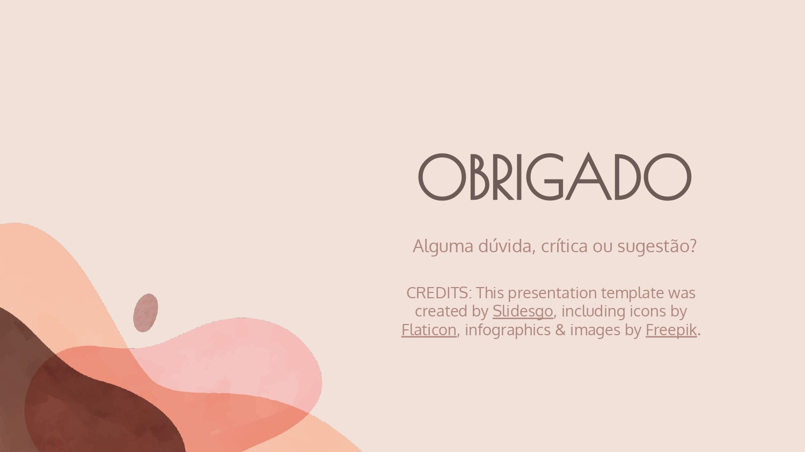

# 3º Ponto de Controle

## Descrição
O terceiro ponto de controle da disciplina foi a elaboração de um vídeo explicando o andamento do projeto para o professor. Nele, discutimos sobre a finalização do [protótipo de média fidelidade](../project/prototypes/mid-prototype.md), da análise dos resultados  e conclusão do [questionário de usabilidade](../project/surveys/survey-01.md), e por último, a construção do [roteiro do teste de usabilidade](../project/interviews/interview-script.md).

## Apresentação

## Histórico de revisão

| Data | Autor | Modificações | Versão |
| ---- | ----- | ------------ | ------ |
| 11/10/2021 | [Luís Lins](https://github.com/luisgaboardi) | Criação do arquivo e adiciona descrição | 1.0 |